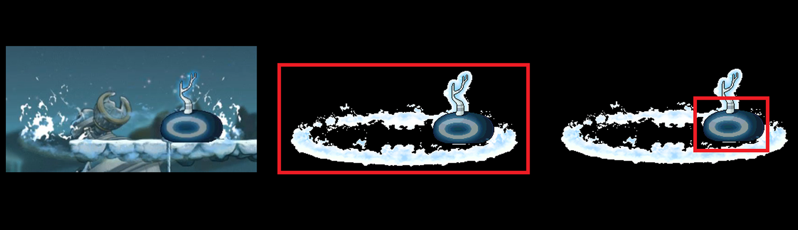
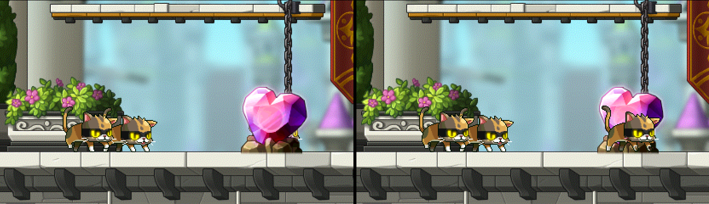
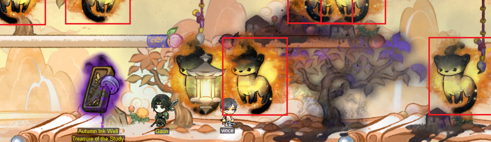
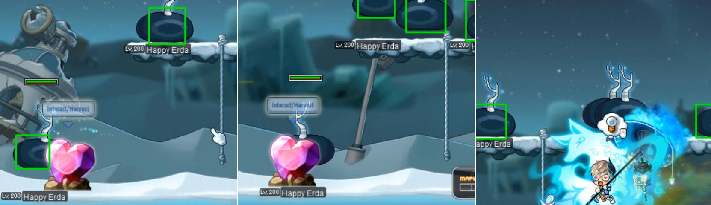
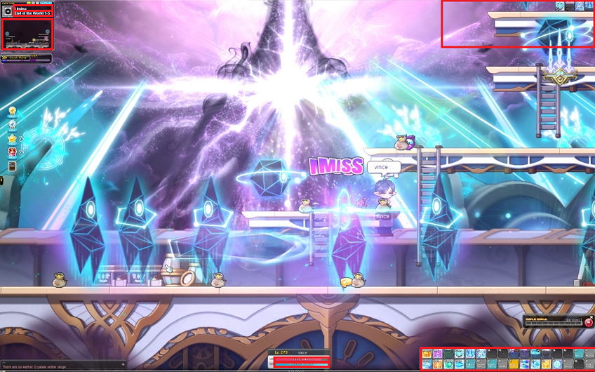
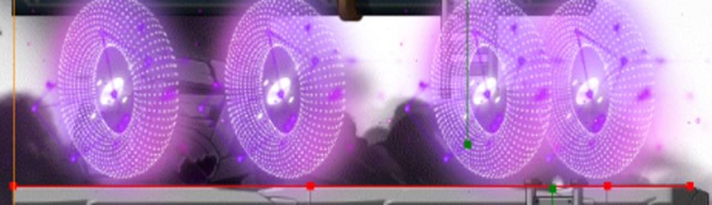

# Section 1 - AIMS

## AIMS (AI-MapleStory) 
The development of practical, large-scale artificial intelligence (AI) models remains a pivotal challenge in the field of machine learning. Our interest lies in exploring the intricacies of this challenge by engaging in a project with tangible, complex objectives. This text details our efforts to construct a robust AI agent with the capability to automate gameplay in MapleStory—an online multiplayer game—while discussing existing security measures.

My background includes extensive experience in developing backends for MapleStory emulators, providing a unique insight into the game's mechanics and potential avenues for automation. Leveraging this knowledge, this project pursues a dual-purpose: to determine whether it is practical to create an AI agent that can efficiently and effectively simulate human-like behavior and to examine the server-side security models to evaluate and enhance their efficacy in detecting such AI agents.

### Background
MapleStory is a 2D side-scrolling massively multiplayer online role-playing game (MMORPG). Within MapleStory, in short, players control avatars to traverse diverse landscapes, fight with various monsters, upgrade and enhance equipment, complete challenging quests, and engage with other players in a rich development of in-game events and activities. There are various considerations to be made such objective functions to determine the best decision at any event slice.

### Ethical Consideration
The project's source code remains closed and will not be publicly disclosed. The agent's development serves exclusively educational purposes and is unequivocally not intended for deployment on official MapleStory servers. In other words, the agent remains undeployed in official-nexon server scenarios, with all data acquisition executed offline via emulation. I have long since quit playing MapleStory's official servers. Should Nexon representatives have any questions or concerns, please reach out to me so that I may address your concerns.

### Text Overview - Goals
The scope of the project is ambitious. The remainder of this text is structured into sections, each outlining a practical objective which provided a roadmap for advancing the project.


# Section 2 - Environment Wrapper
## Objective 1 - Game Asset Retrieval
The first objective was to retrieve sprites and other game assets from MapleStory's files. MapleStory's game files are partitioned into *.wz* files. It is not uncommon for a single asset, such as a monster, to be split up between multiple *.wz* files, such as mob.wz, sound.wz, string.wz, etc; `FETCH` and `FETCH-MAP` was our solution to accessing game files across a partition of *.wz*. files.

### `FETCH, FETCH-MAP`
The FETCH interface is our solution for accessing MapleStory's game files, especially the .wz files, in an time and space efficient manner. Its primary purpose is to enable on-demand retrieval of game assets with minimal overhead. This approach eliminates the need for extensive storage space, which would be otherwise required if we exported all data in the preprocessing step. 

Complementing FETCH is FETCH-MAP, a procedure for addressing the issue of fragmented game assets. FETCH-MAP is designed to identify and group related assets. It acts as a mapper, locating and linking all related assets as a single usable group. 

It is beneficial to imagine a graph G where each data point in the *.wz* files represents a single vertex and each edge represents some form of relationship between any two data points. Consider the following examples:
1. If there exist a monster M and a field R, and M appears in R, then the edge (M, R) exists in G. 
2. If there exist a field R1 connected to another field R2, then (R1, R2) exists in G.
3. If there exist an equip E that requires item I to make it, then (E, I) exists in G.


## Objective 2 - Generating the Data Set
The second objective focused on assembling a high-quality data set, a crucial element for any model. As of December 2023, the game MapleStory featured approximately 4,000 monsters, each with an average of about 43 sprites. The impracticality of manually collecting screenshots and labeling them led to the development of GENERATE-DS, a tool designed for generating labeled training data.

### `GENERATE-DS`
The GENERATE-DS interface generates labeled training data. Using FETCH-MAP and preprocess, GENERATE-DS finds the neighborhood `N` of a specified data point `P` to generate samples. `N` is filtered with `F1` to remove a predefined set of data point types such as fields (i.e., `F1` is defined by the user to remove undesired first-order neighbors). Next, GENERATE-DS samples from the second-order neighborhood of `P`, but only considers points `Q` of the same type such that `P` and `Q` are instances of the same object. This filter `F2` allows us to generate entities in the same field but not necessarily the target. For example, suppose there exist a target monster `M1`. GENERATE-DS places samples from `F1(N(P)) + F2(N(q_i))` where `q_i` is a data point in the second-order neighborhood of `P`.

This in concept was okay, however, we ran into two considerable issues: sprite bounding boxes and sprite intersections.

### Concern 1 - Sprite Bounding Boxes
A recurring issue encountered with GENERATE-DS pertained to sprites with a high proportion of transparent pixels relative to non-transparent pixels. In such cases, GENERATE-DS might inadvertently incorporate a significant part of the background into the labeled targets. This complication stems from GENERATE-DS's dependency on the image's dimensions to establish its native bounding box. The challenge was to reduce transparent pixels effectively while retaining as many meaningful pixels as possible. However, constructing a bounding box that contains only essential pixels was not a viable solution due to potential risks like overfitting in the trained model. Our approach involves iterative threshold reduction. 

We begin with the sprite's full dimensions to define an initial bounding box and then decrease its size methodically. The reduction is executed by systematically removing a single row or column of pixels from any one of the four edges—top, bottom, left, or right—of the image. This procedure is repeated until the sprite reaches a specific density threshold, where density is calculated as the ratio of transparent pixels to the overall pixel count. We also established a threshold for transparency, considering pixels with a sufficiently low alpha channel as transparent. Despite its effectiveness, this method has limitations in bounding box reduction, mainly due to the constraint of removing pixels in only one of the four possible directions and the need to eliminate entire horizontal or vertical lines from the selected edge in order to prevent the formation of convex shapes. 

The accompanying images below illustrate the issue under discussion. The first image displays a monster with a high proportion of transparent pixels. The second image highlights the monster's sprite against a black background, clearly outlining the sprite's initial bounding box. The third image demonstrates the reduction process to preserve meaningful pixels up to a defined limit. It is important to note that the black background might enhance the alpha channel of some pixels, potentially affecting the visual interpretation of which pixels are essential to retain.



### Concern 2 - Sprite Intersection
A pivotal aspect of placing targets on the canvas within GENERATE-DS involves managing the z-index, which dictates the layering order of images. When two images overlap, the one with a higher z-index obscures the other at their intersection. Consequently, images with a high z-index do not inherit background noise. To address this, we employ a method to introduce relative noise artificially by utilizing FETCH-MAP. This technique allows for the simulation of noise naturally occurring in data collection. Additionally, we can elevate the z-index of an object intersecting with the target to surpass the target’s z-index. The decision to increase an object’s z-index is based on its relational existence within the game files. However, this approach poses a new challenge: excessive coverage of the target by an intersecting object, potentially leading to mislabeling.

To mitigate this, we developed two strategies. The first strategy involves determining a coverage threshold and quantifying the overlap between the covering image and the target. This method, however, encountered difficulties with images characterized by high dimensionality and abundant transparent pixels. Despite significant coverage, the target image remained distinctly visible in such cases. The second strategy, an iteration of the first, considers the density of transparent pixels. We can calculate the transparency pixel density of an image in linear time. By setting a specific threshold, we permit high coverage if the transparency pixel density meets this criterion.

Nevertheless, both approaches, involving a visibility/coverage metric, proved inefficient and thus required further refinement. When the transparency level of the covering image is too low, the entity is not labeled, and the program proceeds without labeling it. In other words, if two images intersect and the higher z-index image lacks sufficient transparency, the program will not label the target as it remains obscured behind the conflicting sprite.

The images below illustrate the issue mentioned above. In this scenario, the program’s goal was to label each cat. However, due to the low transparency of the pixels in the heart-shaped rock obscuring the rightmost cat, the program abstained from labeling it to prevent inaccurate labeling. The rightmost image depicts the same scene but with the z-index of the rightmost cat increased, highlighting the challenge of balancing visibility and accurate labeling.




### Objective 2 - Results
The outcomes generated by GENERATE-DS are characterized by a significant trade-off between runtime efficiency and resource utilization. Although the process demands substantial effort to enhance its runtime performance, we acknowledge this as an acceptable compromise in order to minimize disk space and memory consumption. Moreover, it is important to note that once a model has been trained using data from GENERATE-DS, there is little necessity to retrain a new model for the same field. 




## Objective 3 - On-Demand Model Generation
Following the development of GENERATE-DS and the establishment of a quality data set, the third objective focuses on training an image detection model. Leveraging the capabilities of the GENERATE-DS interface, we aim to facilitate the generation of pretrained models on demand. For the purpose of image classification, we selected OpenCV2's cascade classifier due to its effectiveness and ease of integration.

GENERATE-CL
Given its compatibility with OpenCV2, which offers standalone binaries that readily accept input samples from GENERATE-CL, this tool emerged as the most logical choice for our needs. Utilizing the guidance provided in the OpenCV2 documentation, we configured various parameters such as acceptanceRatioBreakValue for early stopping, bt for boosting methods, weightTrimRate for dropout rates, mode for feature filter types, among others. Remarkably, each classifier required only a few minutes to train, demonstrating the efficiency of this approach.

The results, as illustrated in the following image, indicate promising progress in model performance. In the sequence of three frames, the first frame successfully detects the bottom left monster when it is mostly visible, while the second frame does not detect it when obscured behind a heart-shaped rock—this is a desirable outcome. However, the third frame reveals a limitation of the cascade classifier: it struggles to consistently recognize monsters that are clearly visible. This inconsistency highlights areas for improvement in our pipeline and the classifier's ability to reliably identify targets.



## Objective 4 - Environment Wrapper - `VISION-ENV`
The fourth objective centers on developing the vision component of our environment wrapper, aptly named VISION-ENV. Its primary function is to capture and interpret various aspects of the current game state, presenting them in a format comprehensible to the agent. With GENERATE-DS integration, VISION-ENV efficiently detects the positions of entities like players, monsters, portals, NPCs, reactors, and items. Additionally, it is tasked with discerning and interpreting other subsets of the game state, including player and field states. Player states encompass aspects like health, buffs, and skills, while field states involve details such as current location, player coordinates, platforms, and lootable items.



### Detecting Player Stats
A specific model is not required in scenarios like player health and buff detection, where the target image is generally static with minor overlays indicating different states. Using FETCH, we implement template matching within a defined search space. A confined search space limits the number of comparisons needed, decreasing the time required to identify the target sprite. These search spaces are predefined due to the infrequent changes in the game's UI. Additionally, ranges of interest (ROI) share memory between the original screenshot and the sliced image created to narrow down the search space.

### Detecting Player Location
An (x,y) coordinate pair represents the player's location. Preliminary preprocessing is necessary to determine a player's position, including calculating the current map's dimensions and minimap, along with the map offset--all readily available through FETCH. The player's position is pinpointed by locating their marker on the minimap. After determining our position, we apply a map offset derived from the .wz files via FETCH. Each map has a central point similar to an origin on a plot; without accounting for this offset, the agent might misinterpret the locations of entities on the map due to a skewed perception of the player's actual position.

### Detecting Monster and Item Locations
Monsters and items are also located using (x,y) coordinate pairs. Unlike player locations, monster locations are not displayed on the minimap. Therefore, their positions are calculated as normalized relative coordinates (x', y'), representing the distance between the player's and the monster's bounding boxes. This method is similarly applied to item locations.

### Detecting Footholds
Footholds in MapleStory are identified by pairs of coordinates obtainable through FETCH. These coordinates form lines on which players can stand. However, the game's management of footholds is inefficient, as multiple footholds may represent a single platform.



We address this inefficiency through foothold reduction, achieved by sequentially taking dot products, significantly diminishing the number of footholds. The aim is to amalgamate as many straight, aligned footholds as possible. For example, a single platform with four footholds in a map abundant with platforms could be reduced from hundreds of footholds to merely tens or fewer.

We calculate the relative position between the player and the foothold using these reduced footholds.  


### Representation
Information such as health and locations is encoded into tensors and assigned normalized numerical IDs. These IDs are categorical; for instance, any entity within a category like 'monster' is labeled with a corresponding normalized category ID. Positions of entities other than the player are encoded as normalized relative positions to the player, with values closer to 0 indicating proximity and those closer to 1 denoting greater distance. For ranges like platforms, the relative position is determined by selecting the point within the range nearest to the player.

Tensors are designed with fixed dimensionality, achievable by setting a predetermined size for encodings with multiple potential entries, such as buffs, monsters, items, and platforms. At present, we have efficiently limited these categories to 20 entries. Portals are fixed at one entry, considering their relevance primarily when the agent requires navigation. This fixed dimensionality ensures consistency and facilitates tensor indexing.

Below is an example of a tensor with predefined and normalized IDs. For clarity, lines have been added for ease of reading.

```py
[ HEALTH ID,     CURRENT HEALTH,  MAX HEALTH         ]
------------------------------------------------------
[ MANA ID,       CURRENT MANA,    MAX MANA           ]
------------------------------------------------------
[ POSITION ID,   X,               Y                  ]
------------------------------------------------------
[ LOCATION ID,   FIELD ID,        TARGET FIELD ID    ]
------------------------------------------------------
[ PORTAL ID,     RELATIVE X,      RELATIVE Y         ]
------------------------------------------------------
[ BUFF ID,       BUFF 1 ID,       BOOL: IS AVAILABLE ]
[ ...,           ...,             ...                ]
[ BUFF ID,       BUFF 20 ID,      BOOL: IS AVAILABLE ]
------------------------------------------------------
[ ITEM ID,       RELATIVE X 1,    RELATIVE Y 1       ]
[ ...,           ...,             ...                ]
[ ITEM ID,       RELATIVE X 20,   RELATIVE Y 20      ]
------------------------------------------------------
[ MONSTER ID,    RELATIVE X 1,    RELATIVE Y 1       ]
[ ...,           ...,             ...                ]
[ MONSTER ID,    RELATIVE X 20,   RELATIVE Y 20      ]
------------------------------------------------------
[ PLATFORM ID,   RELATIVE X 1,    RELATIVE Y 1       ]
[ ...,           ...,             ...                ]
[ PLATFORM ID,   RELATIVE X 20,   RELATIVE Y 20      ]
```

## Objective 5 - Environment Wrapper - `INPUT-ENV`
The fifth objective involved developing an interface for sending inputs to the client, for which we chose the Interception driver. Alternative solutions, such as Python keyboard libraries, were deemed unsuitable due to their significant input lag. Furthermore, we developed our own wrapper, addressing the inadequacies of existing wrappers. The remaining task entailed utilizing FETCH to create a configuration file. This file enables players to map skill and item IDs to specific keyboard keys and action types. An action type was an encoding which indicated if the keystroke was an attack, heal, or movement input. 

## Results


# Section 3 - Training the Model
## Objective 6 - Objective Functions
## Objective 7 - Training the Model
## Results


# Section 4 - Preventive Measures
## Behavioral Detection
## Kernel Memory and Signatures
## Results